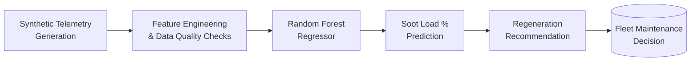

<div align="center">

# 🛢️ DPF Soot Load Prediction
### Predictive Maintenance Pipeline for Diesel Particulate Filters

[](https://www.python.org/)
[](https://scikit-learn.org/)
[](https://jupyter.org/)
[]()
[]()

*An end-to-end machine learning pipeline that estimates Diesel Particulate Filter (DPF) soot load from vehicle telemetry and recommends proactive regeneration — built to minimize unplanned downtime across a fleet.*

[Overview](#-overview) •
[How It Works](#-how-it-works) •
[Getting Started](#-getting-started) •
[Methodology](#-methodology) •
[Roadmap](#-roadmap) •
[Author](#-author)

</div>

---

## 📌 Overview

Commercial diesel vehicles fitted with Diesel Particulate Filters (DPF) accumulate soot continuously during normal operation. Left unmanaged, excessive soot loading triggers **engine derate events, forced regenerations, elevated fuel consumption, and unplanned downtime** — all of which carry real operational cost for a fleet.

This project frames DPF soot load estimation as a **regression problem** rather than a binary alert, predicting a continuous **soot load (%)** from synthetic sensor telemetry. A continuous output lets operators apply flexible, configurable thresholds per vehicle type or fleet policy, rather than being locked into a single hardcoded alarm point.

The repository documents the full lifecycle of that approach — synthetic data generation, feature engineering, modeling tradeoffs, evaluation strategy, and production/MLOps considerations — as a worked example of predictive-maintenance system design.

> **Note on scope:** Real-world DPF telemetry is proprietary, so this project uses physically-motivated **synthetic data**. The goal is internal consistency and sound engineering reasoning, not a calibrated physical model. Sections describing API serving, containerization, and monitoring describe the **intended production design**; see [Roadmap](#-roadmap) for current implementation status.

---

## 🧩 Problem Framing

| Question | Answer |
|---|---|
| **What are we predicting?** | Continuous DPF soot load (%), with a derived regeneration recommendation based on configurable thresholds |
| **Why regression, not classification?** | Flexible thresholds beat a fixed binary cutoff — different vehicles/fleets can tolerate different risk levels |
| **What matters more — false positives or false negatives?** | False negatives (missed warnings) are far costlier — they risk engine derate and downtime. False positives only cost a minor fuel penalty. The system is intentionally biased toward **early warning**. |
| **Primary metric** | Mean Absolute Error (MAE) — aligns more closely with operational cost than squared-error metrics |

---

## ⚙️ How It Works



**1. Synthetic Data Generation** — 20 simulated vehicles, sensor readings every 5 minutes over a 30-day window, plus an event-based regeneration log. Soot accumulation scales with engine load and operating conditions; differential pressure rises with soot buildup; readings include realistic noise and drift.

**2. Feature Engineering** — Rolling averages of exhaust temperature and differential pressure smooth noisy signals and capture sustained operating trends; the pre/post-DPF temperature delta proxies regeneration effectiveness. All features are vehicle-aware and strictly time-ordered to prevent data leakage.

**3. Modeling** — A `RandomForestRegressor` was chosen for its robustness to noisy sensor data, ability to capture non-linear relationships, minimal preprocessing requirements, and reasonable interpretability via feature importances.

**4. Evaluation** — MAE on held-out data, with focused error inspection in the critical 60–80% soot-load band where regeneration decisions matter most.

---

## 📊 Datasets

| Dataset | Description |
|---|---|
| **Sensor Telemetry** | Engine load, pre/post-DPF exhaust temperature, differential pressure, exhaust flow rate, vehicle speed & RPM, ambient temperature, and ground-truth soot load (training only). 5-minute granularity, 30 days, 20 vehicles. |
| **Maintenance / Regeneration Records** | Event log of vehicle ID, regeneration timestamp, and regeneration type, triggered once soot load crosses a defined threshold — simulating real maintenance logs. |
| **Trip Characteristics** *(conceptual)* | Trip duration, distance, and driving-pattern aggregates, scoped as a future enrichment for driving-behavior features. |

**Data quality & versioning:** missing-value thresholds, statistical sensor-drift detection, and logical sensor bounds are checked prior to inference. Each dataset and model artifact is tagged with a generation timestamp, feature schema, and model version for traceability and safe retraining.

---

## 🚀 Getting Started

### Prerequisites
- Python 3.9+
- Jupyter Notebook / JupyterLab
- `numpy`, `pandas`, `scikit-learn` (see [Installation](#installation))

### Installation

```bash
# Clone the repository
git clone https://github.com/AmanManiTiwari/dpf-soot-load-prediction.git
cd dpf-soot-load-prediction

# Create and activate a virtual environment
python -m venv venv
source venv/bin/activate      # Windows: venv\Scripts\activate

# Install core dependencies
pip install numpy pandas scikit-learn jupyter
```

> A pinned `requirements.txt` is not yet included in this repository — see [Roadmap](#-roadmap).

### Run the Notebook

```bash
jupyter notebook main.ipynb
```

`main.ipynb` walks through synthetic data generation, feature engineering, model training, and evaluation end to end.

---

## 🧠 Methodology

### Tradeoffs Considered

| Aspect | Decision |
|---|---|
| False positives | Accepted — minor fuel penalty |
| False negatives | Treated as high cost — risk of engine derate / downtime |
| Early warning | Prioritized over marginal accuracy gains |
| Interpretability | Balanced against raw predictive performance |

### Evaluation Strategy

- **Offline:** MAE across historical data, with targeted error analysis near the 60–80% critical soot-load range.
- **Production (designed):** monitoring prediction distributions over time, comparing predictions against post-regeneration outcomes, and tracking false-alert rates. Success is measured by the **reduction in unplanned maintenance events**, not model accuracy alone.

### Robustness & Edge Cases

The design accounts for missing sensor readings, out-of-range values, cold-start vehicles with new DPFs, immediately-post-regeneration states, and delayed or stale data — validated through unit tests on feature logic, integration tests on the full pipeline, and mock data simulations.

---

## 🏭 Production Design (Target Architecture)

The system is designed to extend beyond the notebook into a deployable service:

```
┌─────────────┐     ┌──────────────────┐     ┌─────────────────┐
│  Telemetry  │ --> │  FastAPI Service  │ --> │  Regeneration    │
│  Ingestion  │     │  (model serving)  │     │  Recommendation  │
└─────────────┘     └──────────────────┘     └─────────────────┘
```

**Planned API surface:**

| Endpoint | Purpose |
|---|---|
| `POST /predict/soot-load` | Single-vehicle soot load prediction |
| `POST /predict/batch` | Batch prediction across a fleet (extendable) |
| `GET /model/info` | Active model version and metadata |
| `GET /health` | Service health check |

The service is intended to be stateless and containerized (Docker, pinned dependencies) for cloud or edge deployment across a fleet.

---

## 📁 Project Structure

```
dpf-soot-load-prediction/
├── main.ipynb     # End-to-end pipeline: data generation → features → model → evaluation
└── Readme.md       # Project documentation
```

---

## 🗺️ Roadmap

- [ ] Extract pipeline logic from `main.ipynb` into reusable Python modules (`src/`)
- [ ] Add `requirements.txt` / `pyproject.toml` for reproducible environments
- [ ] Implement the FastAPI serving layer described above
- [ ] Add Dockerfile for containerized deployment
- [ ] Integrate trip-level driving-behavior features
- [ ] Add automated unit/integration tests and CI
- [ ] Publish evaluation metrics and sample plots in-repo

---

## 🤝 Contributing

Issues and pull requests are welcome. If you're proposing a significant change, please open an issue first to discuss the approach.

## 📄 License

No license has been specified for this repository yet. Until one is added, all rights are reserved by the author.

## 👤 Author

**Aman Mani Tiwari**
Built as a Data Science Intern technical assignment.

[](https://github.com/AmanManiTiwari)

---

<div align="center">
<sub>If this project was useful or interesting to you, consider starring ⭐ the repository.</sub>
</div>
